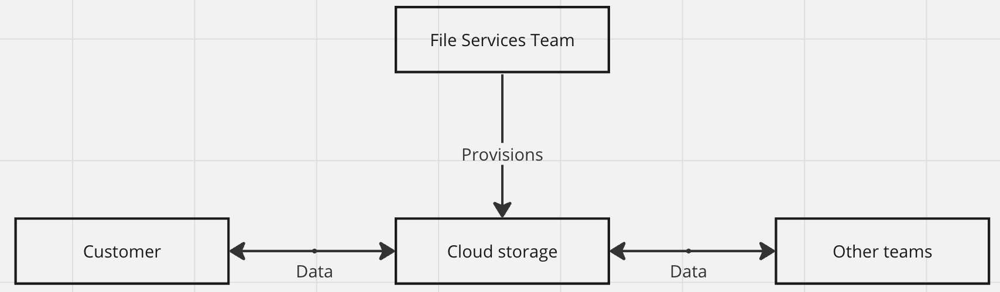
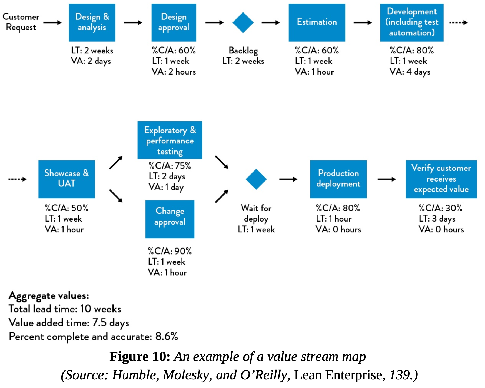

# Value Stream Mapping Workshop at Relex: Introduction

<!-- Google tag (gtag.js) -->

Hi! I’m Miguel, I work as a DevOps Engineer in the File Services team at Relex, and I want to share my experience facilitating a Value Stream Mapping workshop within the team.

This has the potential for huge gains in value generated for the customers and Relex. This kind of exercise brings together multiple people, combines our unique perspectives on a complex system of work, **identifies the biggest improvement points**, and **creates a plan to tackle them**. All while generating the needed consensus for these improvements to move forward and create organizational learnings.

Let’s get started!

First, some context: Our team provides a service to other teams. We provide cloud storage and companion infrastructure for other teams in the company, mainly to serve as a landing zone for data we receive from our customers, which is then processed by other teams, which produce an output, which is then returned to the customer, via our cloud storage infrastructure, where the data generates value for the customer.

## Inspiration and Objective

We have a long, tedious, manual, and error-prone deployment process. **It currently takes 21 days to deploy** and past deployments have caused service disruptions that went undetected for days and were first noticed by the customers!

My business hypothesis is that **it's possible to have deployment processes that take minutes**, where service disruptions are detected and corrected immediately, even before the customer notices!

Reading about Value Stream Mapping in [The DevOps Handbook (Kim et al., 2021)](https://itrevolution.com/product/the-devops-handbook-second-edition/) and watching the [presentation at the 2020 DevOps Enterprise Summit by Paula Thrasher](https://videos.itrevolution.com/watch/466912411/) inspired me to organize a value stream mapping workshop for my team.

My aim with this workshop was to **drastically improve our deployment process** by first generating consensus among the team on what are the most important things to improve, and then working on those things.

## What is a Value Stream Map?

In the context of Technology work, **a Value Stream is the process required to convert a business hypothesis into a technology-enabled service or feature that delivers value to the customer**. We create a Value Stream Map by drawing this process. Here’s an example of what it can look like:

Legend:
* **%C/A - % Complete and Accurate:** %C&A represents the percentage of tasks or deployments completed correctly and fully the first time, without the need for rework or additional efforts due to errors or omissions.
* **LT - Lead Time:** it’s the time it takes for a piece of work to go from start to finish
* **VA - Value Added Time:**  it’s the portion of work that directly contributes to the customer value of a product or service.

## The Utility of the Exercise

In this exercise, we used our latest deployment as the base for our map. This allowed us to visually observe the workflow and **identify waste areas and their impact**. This understanding enabled us to prioritize waste sources according to their impact, plan improvements, set goals, **define actionable steps** for immediate implementation, and establish **metrics to track progress** towards these goals. The results are shown in the upcoming article about session 1. More importantly, this was all possible because of the **generated consensus in the team**.

## Real-World Impact: A Case Study

An example from the DevOps Handbook illustrates the impact of such an approach: Courtney Kissler conducted a workshop at Nordstrom, **reducing process lead times from days to seconds**. This kind of improvement doesn't just add value: it multiplies it!

I can't wait to share more with you about the results we're getting by applying these techniques!

## Workshop Setup: Challenges and Considerations

One of the initial steps was identifying the value stream members, including:

* From our team: 2 software engineers, 1 team lead, 1 product owner
* From other teams: Members of 2 teams using our service, customer support, technical consultants, and a technology executive or manager

While including a broader group could enrich the workshop and impact of the results (by bringing more perspectives and knowledge), it also adds complexity. Therefore, I decided to keep the initial workshop within our team for smooth operation, with the possibility of including more people in future sessions.

## Workshop Structure

* [Session 1: Mapping the Deployment Process](Value_Stream_Mapping_Workshop_at_Relex_Session_1.md)
* [Session 2: Identifying Improvements and Prioritising Actions](Value_Stream_Mapping_Workshop_at_Relex_Session_2.md)
* Session 3: Planning Countermeasures for Prioritized Waste
* Session 4: Follow-up and Next Steps

Each session starts with some time reserved for reading a briefing with relevant data for the session, then a discussion about ideas, thoughts, questions that came up when reading the briefing, then the activities start.

## Next steps

In the next articles I’ll go over what we did in each session and what results we achieved. Stay tuned!

## References

* Kim, G. et al (2021), The DevOps Handbook, 2nd Edition, IT Revolution Press, ISBN: 9781950508433. Available from: <https://itrevolution.com/product/the-devops-handbook-second-edition/>
* Humble, J., Molesky, J., & O'Reilly, B. (2014). Lean Enterprise: How High Performance Organizations Innovate at Scale. O'Reilly Media, Inc. ISBN: 9781449368425. Available from: <https://www.oreilly.com/library/view/lean-enterprise/9781491946527/>
* Thrasher, P. (2020). Interactive Virtual Value Stream Mapping - Visualizing Flow in a Virtual World. Presented at the DevOps Enterprise Summit. Available from: <https://videos.itrevolution.com/watch/466912411/>
