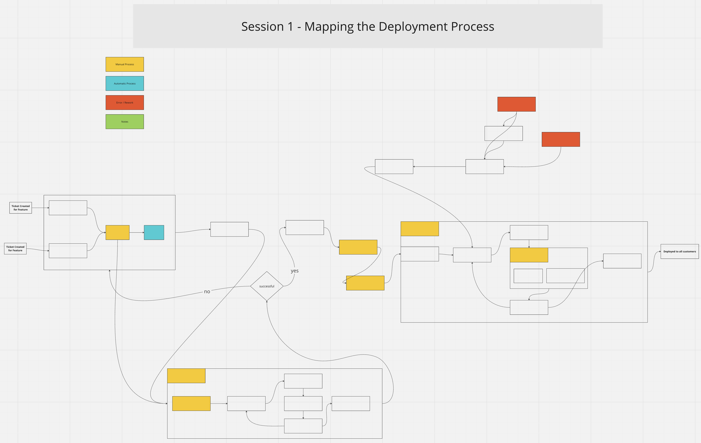

# Value Stream Mapping Workshop at Relex: Session 1

<!-- Google tag (gtag.js) -->

## Introduction

The following is adapted from the briefing we read together at the beginning of the session and includes the resulting Value Stream Map

**Workshop Structure**

* Session 1: Mapping the Deployment Process
* Session 2: Identifying Improvements and Prioritising Actions
* Session 3: Planning Countermeasures for Identified Waste
* Session 4: Follow-up and Next Steps

**Objective of Session 1**

To *Collaboratively map out the entire deployment process on a flow chart*. The goal is not to collect every step, but to get the main picture, so we can visualize the current state of the workflow. We’ll be mapping the latest deployment done to date. It's important to focus on a specific deployment because we have actual data on how it happened, which will help us with the mapping, impact, and cost analysis.

**Session Structure**

* Part 1: (15min) Reading the session briefing, taking notes of thoughts, questions
* Part 2: (15min) Discussion
* Part 3: (rest of the session) Build the map in a miro board

## Key Discussion Points

* What did the process look like from Feature in a User Story to Customer getting value from the Feature, in this particular deployment?
* How are we noticing if an environment is still working properly after a deployment?

## Metrics

The goal was to provide the supporting data to help in the discussion and mapping exercise. Relevant metrics that help us analyze the deployment are:

* **Deployment lead time** is the duration it takes to go from code committed to code successfully running in production, which was 21 days. This metric is crucial in understanding the efficiency and responsiveness of any software deployment process.
* **Percent Complete and Accurate (%C/A)** for the deployment
    * %C/A represents the percentage of tasks or deployments completed correctly and fully the first time, without the need for rework or additional efforts due to errors or omissions.
    * %C/A = [(Total Deployments - Unsuccessful Deployments) / Total Deployments] * 100

## Importance of Reducing Deployment Lead Times

### Why Focus on Reducing Deployment Lead Times?

#### Deliver Value to the Customer

Because value is only delivered when our code is running in production, we must ensure that not only we are delivering fast flow, but that our deployments can also be performed without causing chaos and disruptions.

#### Improved Quality and Reduced Risk

Frequent, smaller deployments reduce the complexity of each release, lowering the risk of major failures. Quick detection and correction of problems, facilitated by robust feedback and telemetry systems, prevent issues from escalating. This maintains system stability and reliability.

**How Feedback and Telemetry Help:** Implementing continuous feedback and telemetry allows for real-time monitoring of deployments. It enables the team to quickly identify anomalies or issues as they arise, leading to immediate corrective actions. This continuous feedback loop and adjustment is key to maintaining high-quality, reliable services.

#### Increased Efficiency

Streamlining and automating deployment processes cut down on lead times, improving overall efficiency and reducing manual effort.

Focus on minimizing time-consuming and repetitive manual tasks. This shift allows us to better utilize our skills and expertise in engineering to better support our customers and colleagues. By optimizing our processes, *we can significantly boost efficiency without increasing resource allocation*. We need to make sure that we’re doing the things that provide the most value, or we’ll get drowned in inefficiencies and take too long to get things done.

#### Feedback and Learning

Shorter lead times enable quicker feedback from users, feeding a cycle of continuous improvement and learning.

This is essential to keeping up with the compound interest cost of technical debt, while maintaining both the service reliability and the ability to develop new features.

### Consequences of Long Deployment Lead Times

#### Increased Risk

Longer lead times often mean larger, more complex deployments, increasing the likelihood of errors and the time required to resolve them. This can lead to situations where customers notice issues before we do, damaging trust and reputation.

#### Poor Customer Outcomes

Delays in deploying new features or fixes can lead to customer dissatisfaction, as customers take longer to get value from the deployed features.

#### Missed Opportunities

Slow deployment processes can result in missed market opportunities and an inability to respond promptly to competitive challenges.

By reducing time spent on manual, process-heavy tasks, we can redirect our efforts towards activities that directly benefit customers, support other teams, and contribute to the company's overall goals.

#### Our Current Status

**Our Lead Time:** As mentioned, our current total lead time for the deployment is 21 days. During this workshop, we explored strategies to reduce this time frame, making our deployment process more agile and efficient.

#### Improving Our Deployment Lead Time

We can measure Deployment Lead Time and Percent Complete and Accurate (%C/A) for each deployment, regularly reviewing these metrics to see the effectiveness of our actions and make necessary adjustments.

## Importance of Cost Estimations

We’re looking at the process that transforms ideas into value generated for the customer. It's important to look at how much this is costing us now, and as we make improvements, observe what is happening to the costs.

This will also help motivate people towards making improvements in the process: money talks.

I made an initial cost estimate for this particular deployment, which will be useful as we improve our deployments to see what happens to our costs. This helps us understand the impact of our work.

I can't share the cost estimation but I can share some components that can be used to estimate costs for deployments

* Revenue of the service
* Impact of specific deployments
* Man-hours for deployments
* Opportunity cost of a long deployment lead time
* Investigate if we have cost estimations from other company services that we can use in our cost model

[How do you estimate the costs and revenue from features/deployments? I'd love to hear your feedback.](https://docs.google.com/forms/d/e/1FAIpQLSdaqgU-wePXN38fKege4Y6mFd90XFlSIdHl_mqp8mMeuWj_5Q/viewform?usp=sf_link)

## Session 1 Results

During the session, we mapped the process from the creation of a User Story detailing the feature, to when it is deployed to the customer.

We included defects and rework in this map and color-coated parts of the work as Manual, Automated, Errors/Defects.

Now we have mapped our value stream. We’re in a position to start identifying areas of waste, so we know exactly what we need to improve and what's the impact. We did that in session 2.

### Next steps

In the next article, I’ll go over what we did in session 2 and what results we achieved. Here's what's coming up:

* Session 2: Identifying Improvements and Prioritising Actions
* Session 3: Planning Countermeasures for Identified Waste
* Session 4: Follow-up and Next Steps

### I'd Love to Hear Your Thoughts

As we wrap up the introduction to the Value Stream Mapping workshop at Relex, I'm excited to hear from you! [Please add your feedback here, I'll get back to you.](https://docs.google.com/forms/d/e/1FAIpQLSdaqgU-wePXN38fKege4Y6mFd90XFlSIdHl_mqp8mMeuWj_5Q/viewform?usp=sf_link)

* What strategies have you found effective in improving deployment processes and operational efficiency within your teams?
* Are there specific aspects of our approach that you think could be improved or any innovative practices from your experience that could complement our efforts?

Whether it's a suggestion for refining the workshop structure, ideas for smoother operations, or feedback on our current methodologies, I welcome your contributions.

Thank you for reading, have a great day!
