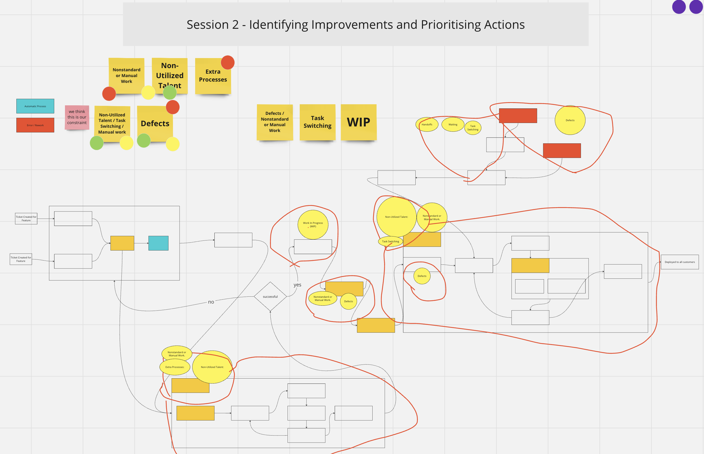

# Value Stream Mapping Workshop at Relex: Session 2

<!-- Google tag (gtag.js) -->

**Workshop Structure**

* [Session 1: Mapping the Deployment Process](Value_Stream_Mapping_Workshop_at_Relex_Session_1.md)
* [Session 2: Identifying Improvements and Prioritising Actions](Value_Stream_Mapping_Workshop_at_Relex_Session_2.md)
* Session 3: Planning Countermeasures for Prioritized Waste
* Session 4: Follow-up and Next Steps

**Objective of Session 2**

Now that we have a vision of the flow of work from [session 1](Value_Stream_Mapping_Workshop_at_Relex_Session_1.md), the goal is to talk about what needs to be improved!

**Session Structure**

* Part 1: (15min) Reading the meeting briefing (from which this article was adapted), taking notes of thoughts, questions.
* Part 2: (15min) Discussion.
* Part 3: (45 min) Group discussion to identify areas of waste in the value stream.
* Part 4: (45 min) Prioritize identified waste based on impact and feasibility of removal.

## Flow and Waste in the Value Stream

*In any value stream, there is always a direction of flow, and there is always one and only constraint (bottleneck); any improvement not made at that constraint is an illusion* - taken from [The DevOps Handbook (Kim et al., 2021)](https://itrevolution.com/product/the-devops-handbook-second-edition/)

When we say there’s only one constraint, we don't mean that there’s only one place slowing down the flow of work. There are multiple places where we can improve, but **there is always one place that is slowing us down the most**. The flow of work is like a line going from start to finish, and because work items move along the line, they have to go through the constraint, and because the constraint is the slowest point, the entire value stream moves at the speed of that constraint.
If we improve a work center that is positioned before the constraint, work will merely pile up at the bottleneck even faster, waiting for work to be performed by the bottlenecked work center.
On the other hand, if we improve a work center positioned after the bottleneck, it remains starved, waiting for work to clear the bottleneck.

## Types of Waste in a Value Stream

**Waste**: is the largest threat to business viability. It is the use of any material or resource beyond what the customer requires and is willing to pay for. Eliminating waste reduces dull and boring work in our day-to-day, creating an ever-safer and more resilient system of work.

* **Partially Done Work:** Incomplete work or work in queues that isn't delivering value and will become obsolete over time.
* **Extra Processes:** Additional steps or processes that add effort and time without contributing value to the output.
* **Extra Features:** Features or enhancements not required by the organization or customer, often leading to unnecessary complexity.
* **Task Switching:** People assigned to multiple projects and value streams waste time in context switching and managing dependencies between projects
* **Handoffs:** Loss of information and/or time during transitions or exchanges between different teams or stages in the process.
* **Waiting:** Any delays between work requiring resources to wait until they can complete the current work. Increase cycle time and prevent value from being created. Waiting often happens in handoffs, for example, when waiting for someone to grant us access to a company service.
* **Defects:** Errors, omissions, or unclear requirements that create waste due to the need for rework, fixes, or clarification.
* **Non-Utilized Talent:** Underutilization of team members' skills and knowledge, leading to inefficiency and missed opportunities for improvement.
* **Nonstandard or Manual Work:** Reliance on ad-hoc, manual processes that could be automated or standardized, leading to inefficiencies and dull and boring work.
* **Heroics:** Situations where extraordinary effort is required to meet objectives, often indicative of underlying process inefficiencies or unrealistic expectations.

For each type of waste, I could have included a specific example from our team’s work. However, it is valuable to let the team identify the waste themselves in our value stream, together with the fact that we are looking at a specific deployment that we did. This keeps the discussion focused on a concrete example and away from hypothetical scenarios.

## Key Discussion Points

* Look at the Value Stream Map we made in session 1, try to find the different types of waste in the map, and identify which type of waste it is. Is this a Defect? A Handoff? Annotate the waste in the map (circle it in pencil and write what type of waste it is).
* Talk about the most annoying waste. Talk about what we think could be our constraint. Perform dot voting to come up with a prioritization. Write the most important waste in some cards and prioritize them.

This was inspired from [Paula Thrasher's presentaion at the 2020 DevOps Enterprise Summit](https://videos.itrevolution.com/watch/466912411/)

## Session 2 Results

In this session, we read and talked about the different types of waste and then identified them in our value stream. Then we voted on the most important types of waste and talked about what we think is our constraint and the most annoying types of waste. This is a great chance for everyone to complain in the most productive way!

I can't give too many details, but here are the 3 most important sources of waste that we identified in our value stream were:

**Waste 1 - Defect:**

* In this deployment there were some defects that were detected only some time after they were introduced. We want to be able to detect possible deployment defects immediately and automatically

**Waste 2 - Non-Utilized Talent / Task Switching / Manual work:**

* Deployments are being done manually for each environment. We have the know-how to improve this but have not done it yet. We need to automate code deployments to our environments.

**Waste 3 - Non-Utilized Talent / Task Switching / Manual work:**

* We have the expertise to automate the testing of features. Testing of features is being done manually. We have the know-how to improve this but have not done it yet

> Note that the constraint is not the waste itself. The waste is a symptom of the constraint, and it helps us find it.

We first thought that *manual code deployments* was our constraint because everything else depends on it, and it's the slowest part (with a lead time of 21 days). On the other hand, after we deploy code to our environments, we’re not checking if the deployment caused any downtime.

We could first automate the deployments, but without knowing whether the service was still working or not, we could end up just causing chaos even faster. This ties back to what we talked about in [Flow and Waste in the Value Stream](#flow-and-waste-in-the-value-stream).

In the end, we agreed that *detecting possible deployment defects immediately and automatically* was the most important improvement (our constraint), followed by *automating code deployments*, followed by *automating the testing of features*.

Now we have identified the waste in our value stream, and have prioritized it according to its impact. We’re now in a position to make a plan to tackle the waste, which we did in session 3.

## Next steps

In the next article, I’ll go over what we did in session 2 and what results we achieved. Here's what's coming up:

* Session 3: Planning Countermeasures for Identified Waste
* Session 4: Follow-up and Next Steps

## I'd Love to Hear Your Thoughts

As we wrap this up, I'm excited to hear from you! [Please add your feedback or questions here, I'll get back to you.](https://docs.google.com/forms/d/e/1FAIpQLSdaqgU-wePXN38fKege4Y6mFd90XFlSIdHl_mqp8mMeuWj_5Q/viewform?usp=sf_link)

* What strategies have you found effective in improving deployment processes and reducing downtime within your teams?
* Are there specific aspects of our approach that you think could be improved? Anything from your experience that could complement our efforts?

Thank you for reading, have a great day!

## References

This article was inspired from the following:

* Kim, G. et al (2021), The DevOps Handbook, 2nd Edition, IT Revolution Press, ISBN: 9781950508433. Available from: <https://itrevolution.com/product/the-devops-handbook-second-edition/>
* Thrasher, P. (2020). Interactive Virtual Value Stream Mapping - Visualizing Flow in a Virtual World. Presented at the DevOps Enterprise Summit. Available from: <https://videos.itrevolution.com/watch/466912411/>
