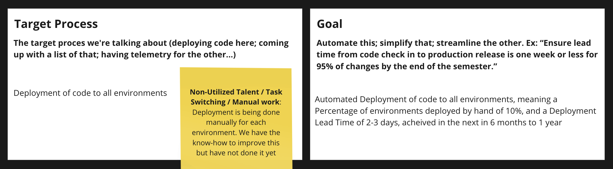

# Value Stream Mapping Workshop at Relex: Session 3

<!-- Google tag (gtag.js) -->

**Workshop Structure**

* [Session 1: Mapping the Deployment Process](Value_Stream_Mapping_Workshop_at_Relex_Session_1.md)
* [Session 2: Identifying Improvements and Prioritising Actions](Value_Stream_Mapping_Workshop_at_Relex_Session_2.md)
* [Session 3: Planning Countermeasures for Identified Waste](Value_Stream_Mapping_Workshop_at_Relex_Session_2.md)
* Session 4: Follow-up and Next Steps

**Objective of Session 3**

After Identifying and prioritizing waste in [session 2](Value_Stream_Mapping_Workshop_at_Relex_Session_2.md), we will work on planning the countermeasures for it.

**Session Structure**

* Part 1: (15min) Reading the meeting briefing (from which this article was adapted), taking notes of thoughts, questions.
* Part 2: (15min) Discussion.
* Part 3: (rest of the session) take the countermeasures for waste from the previous session and further elaborate on them, make a plan of action

## The Importance of Improving Work Processes

> Why is improving work more important than daily work itself?

### The Temptation to Prioritize Daily Tasks

We will be tempted to defer and deprioritize improvement work in favor of customer features, however...

### The Significant Impact of Improvement Work

The impact of improving work is so big, that it gives us so much more capacity, it's even better than adding more headcount. If we reduce the deployment lead time from weeks to minutes, we will be able to go from deploying once per quarter to once per week. In one year **this is the difference between deploying 4 times or 52 times**. Doing this improvement is significantly better than adding more headcount.

### Consequences of Not Improving Work

If we don’t improve work what happens? We do the work, but we are having a bunch of waste so we’ll **not be productive**, we’ll likely have **defects**, and we’ll **miss opportunities to provide value**. Without continual improvement, we risk being drowned in inefficiencies.

In the absence of improvements, **processes actually degrade over time**. This will lead to increased waste, more defects, and ultimately, lower productivity. **Not doing improvement work hurts our ability to do the actual work**.

In the technology value stream, **if we avoid fixing our problems**, relying instead on accumulated, daily workarounds, our problems and technical debt accumulate until **eventually all we’re doing is paying off the tech-debt interest**: performing workarounds, trying to avoid disaster, with no cycles left for doing productive work.

### What can we do about this?

**Start with small, manageable improvements**, and go from there. We can define a small set of goals that generate value and make progress toward the long-term goal and that we can start working on right now!

**Incorporate improvement work in every cycle** so that we are paying off more technical debt that we accumulate.

## Countermeasures for Waste

**Our goal is to create an ever-safer and more resilient system of work**. We do this by **creating feedback loops**: fast, frequent , high-quality information flow throughout our value stream and our organization. This allows us to detect and remediate problems as they are smaller, cheaper, and easier to fix; to avert problems before they cause a catastrophe; and to create organizational learning that we integrate into future work.

### How do we do this?

**Create automated build, integration and test processes** so that we can immediately detect when a change has been introduced that takes us out of a correctly functioning and deployable state

**Create pervasive telemetry** so we can see how all our system components are operating in testing and production environments so that we can quickly detect when they are not achieving our intended goals. Ideally, this is radiated to the entire value stream so we can see how our actions affect other portions of the system as a whole

These create **feedback loops**, that not only enable quick detection and recovery of problems but also inform us on how to prevent these problems from occurring again in the future. Doing this increases the quality and safety of our system of work and creates organizational learning.

In the technology value stream, we often get **poor outcomes because of the absence of fast feedback**. For instance, in a waterfall software project, we may develop code for an entire year and get no feedback on quality until we begin the testing phase - or, worse, when we release software for our customers. When feedback is this delayed and infrequent, it is too slow to enable us to prevent undesirable outcomes.

## Key Discussion Points

We used these to guide the discussion

* Review the prioritized waste areas from the previous session
* Read the Value Stream Canvas below and let your ideas and discussion flow!
* When thinking about baby steps, are we really talking about baby steps?
    * How broad is this improvement? Inside a team? Across teams?
    * How much effort is this improvement?
    * How difficult is this improvement?
    * What is the impact of this improvement?

We will take our waste and make a sort of business plan to tackle it, Called the Value Stream Canvas, similar to a [Lean Canvas](https://leanstack.com/lean-canvas). Here is the Canvas we will work on:

This was inspired from [Paula Thrasher's presentaion at the 2020 DevOps Enterprise Summit](https://videos.itrevolution.com/watch/466912411/)

## Session 3 Results

It doesn't make sense to show all the details here, but we can see an adapted version of the Target Process and Goal for our top 3 sources of waste.

The Canvas helped us create a plan to tackle the most important waste and exploit our constraint.

Generating consensus, motivating the team, and key stakeholders is key to getting these improvements done. We have a small team and these are ambitious goals, but we’re not going to work on everything at once. We started by talking about what is the current state, then we defined the goals and the future state we want to achieve. We also defined “baby steps” that we can start taking right now to get us closer to our goals, and the metrics we can use to track the progress towards the goals. We also acknowledged the possible issues, risks and limitations.

At this point, as a team, we have identified the most important problems to solve, and have made a plan to solve them. Next, we need to talk about how to incorporate these plans into our daily work, which we did in session 4.

## Next steps

In the next article, I’ll go over what we did in session 4 and what results we achieved. Here's what's coming up:

* Session 4: Follow-up and Next Steps

## I'd Love to Hear Your Thoughts

As we wrap this up, I'm excited to hear from you! [Please add your feedback or questions here, I'll get back to you.](https://docs.google.com/forms/d/e/1FAIpQLSdaqgU-wePXN38fKege4Y6mFd90XFlSIdHl_mqp8mMeuWj_5Q/viewform?usp=sf_link)

* What strategies have you found effective in improving deployment processes and reducing downtime within your teams?
* Are there specific aspects of our approach that you think could be improved? Anything from your experience that could complement our efforts?

Thank you for reading, have a great day!

## References

This article was inspired from the following:

* Kim, G. et al (2021), The DevOps Handbook, 2nd Edition, IT Revolution Press, ISBN: 9781950508433. Available from: <https://itrevolution.com/product/the-devops-handbook-second-edition/>
* Thrasher, P. (2020). Interactive Virtual Value Stream Mapping - Visualizing Flow in a Virtual World. Presented at the DevOps Enterprise Summit. Available from: <https://videos.itrevolution.com/watch/466912411/>
